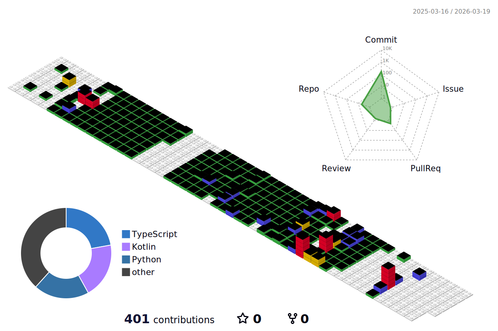

# About Me

> 잡다한거 아무거나 하는 개발자 정영훈입니다.
 

- 🔭 개인 작업물, 아이디어 구현 등등 아무거나 하는 것을 좋아합니다  
- 🌱 최근에는 **머신러닝**, **프론트엔드** 분야에 관심이 많습니다  
- 🎮 Lua는 간단한 모딩, Kotlin은 간단한 모드 레벨 정도로 사용합니다  
- ❤️ **좋아하는 것**: TRPG, 번역, 게임 모딩, 프론트엔드  

---

## 🛠️ Tech Stack

### Frontend  

### Backend / DevOps  

### ML / Python  

### Tools  

### Also Using  

---

## 📊 GitHub Stats

<!-- Hyochan Developer Power Meter -->

---

## 🧊 3D Contribution Graph

<!-- GitHub 3D Contribution (Git Block) -->

---

## 📘 Dev Groundrules

> 개발할 때 쓰는 Git / Commit / 워크플로우 규칙을 모아둔 개인 플레이북입니다.  
> 필요하면 한 번씩 보는 용도 🧾

---

